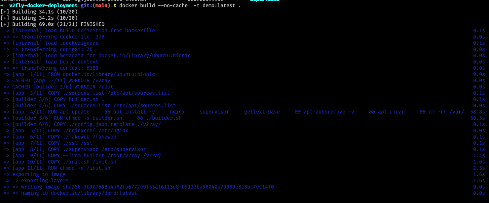

# V2FLY DEPLOY WITH DOCKER (WS+TLS+WEB)

## 为啥

> 方便在多台服务器部署服务 只需修改环境变量

## 准备

- `一个域名`
- `一个SSL证书`
- `一个网站模板`

## Usage

### 环境变量

|        环境变量         |         作用          |   默认    |
| :---------------------: | :-------------------: | :-------: |
|  V2FLY_VMESS_TAG_NAME   | V2ray vmess 标签名  |   nzzz    |
| V2FLY_VMESS_LISTEN_ADDR | V2ray vmess 监听地址 | 127.0.0.1 |
| V2FLY_VMESS_LISTEN_PORT | V2ray vmess 监听端口 |   20443   |
|  V2FLY_API_LISTEN_ADDR  |  V2ray api 监听地址   | 127.0.0.1 |
|  V2FLY_API_LISTEN_PORT  |  V2ray api 监听端口   |   10085   |
|       SERVER_NAME       |         域名          | localhost |
| NGINX_HTTP_LISTEN_PORT  |  Nginx http 监听端口  |    80     |
| NGINX_HTTPS_LISTEN_PORT | Nginx https 监听端口  |    443    |

### 挂载目录

> PS: 可以在构建时复制到镜像里面 无需挂载

|       挂载点       |     作用      |
| :----------------: | :-----------: |
|      /fakeweb      | nginx伪装网站 |
| /ssl/fullchain.cer |    证书crt    |
|  /ssl/private.key  |    证书key    |

### 构建步骤

1. 修改 `config.json.template:28` `clients` 配置

1. 将证书放置到 `ssl` 目录下 ( 包含 fullchain.cer private.key ) 名字必须相同

2. 将网站模板放置到 `fakeweb` 目录下 ( 入口为 index.html )

> 如上两个步骤可以不做 可在启动镜像时挂载 ( 推荐构建镜像时复制到容器内 )

3. 构建镜像 ( 可能存在无法下载最新 `v2ray-core` 的网络问题 )

```shell
docker build -t <名字>:<版本> .
```



